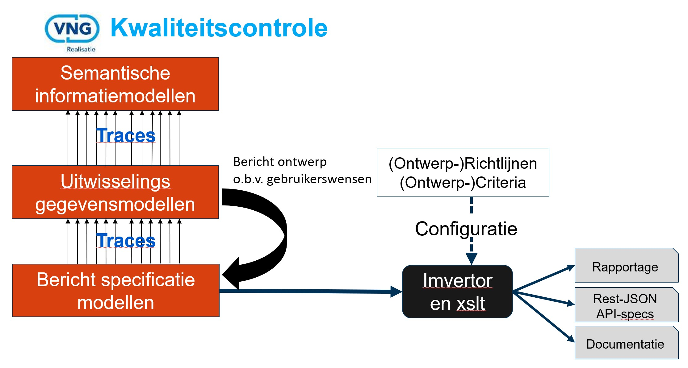

# Inleiding

## Historie

VNG Realisatie is enkele jaren geleden begonnen met het inzetten van Imvertor als tool om de kwaliteit en de consistentie van de informatiemodellen te controleren. Tijdens dit traject ontstond het idee om op basis het informatiemodel en een omzettings-algoritme de basisentiteiten voor StUF te genereren. Toen dit realiseerbaar bleek te zijn bleek dat daar veel consistentie-voordelen aan zaten. Om die voordelen door te trekken naar de daadwerkelijke koppelvlakken is vervolgens ook een methodiek ontwikkeld om de koppelvlakken zelf te modelleren en genereren.
Dit traject viel samen met de verschuiving van de focus binnen VNG Realisatie van StUF-XML naar Rest/Json-API's.
Om deze aanpak toepasbaar te maken voor zowel StUF-XML als Rest/Json API's is er een drielagen-model opgezet. In de afgelopen 2 jaar is de focus volledig verlegd naar het genereren van Rest/Json API-specificaties.

Let wel, het eindproduct van dit traject is een API-specificatie en geen werkende software.  

## Wat is Model Driven Design in de context van VNGR

De Model Driven Design aanpak die door VNG Realisatie is ontwikkeld is gebaseerd op de visie dat het definiëren van uitwisselingsstandaarden begint bij het vastleggen van de semantiek en samenhang van de gegevens in een informatiemodel. Dit informatiemodel dien opgesteld te worden conform het [MetaModel Informatiemodellen](https://docs.geostandaarden.nl/mim/mim/).

Op basis van het informatiemodel van het domein waarbinnen de gegevensuitwisseling plaats gaat vinden wordt er vervolgens een technisch model opgesteld (UitwisselingsGegevensModel). In de technische ontwerp-stap om tot dit model te komen worden keuzes gemaakt die in feite leiden tot de definitie van resources (entiteittypen) en hun onderlinge relaties. Denk daarbij onder andere aan de volgende mogelijke situaties:

- Specialisaties die worden "platgeslagen"
- Objecttypes die worden samengevoegd.
- Relatieklassen die implementeerbaar worden vormgegeven door:
  - De relatieklasse als gegevensgroep op te nemen bij de source van de relatie.
  - De relatieklasse als zelfstandige resource te definiëren
- etc...

Doel van dit UGM is om, in geval dat er meerdere API's worden ontworpen in een domein, er voor te zorgen dat ze een gedeelde resource-definitie gebruiken.

De derde stap is het definieren van de berichtmodellen (BerichtStructuurModellen) waarmee de gewenste endpoints, de te gebruiken parameters en de inhoud van het request en/of de response per te ontsluiten resource worden gedefinieerd. Op basis van dit BSM kunnen dan de API-specificaties worden gegenereerd.

De voordelen die het toepassen van Model driven design met zich meebrengt zijn oa:
- Genereren van documentatie van Informatiemodellen.
- Verschillenrapportages tussen versies van informatiemodellen.
- Relatief snel vervaardigen van API-specificaties.
- Consistentie in wijze van modelleren.
- Consistentie in hergebruik van objecten.
- Consistentie in technische specificaties
- . . .

## Tooling

De kern van de tooling wordt gevormd door:

- Sparx Enterprise Architect (op dit moment versie 15.2)
- Imvertor (middels een SAAS oplossing die is geïntegreerd met Enterprise Architect)
- Subversion

Daaromheen gebruiken we diverse tools voor publiceren, valideren of testen.

- [GitHub](https://github.com/VNG-Realisatie)
- [Swaggerhub](https://app.swaggerhub.com/home)
- [Swaggereditor](https://editor.swagger.io/)
- [Redoc](https://redoc.ly/)
