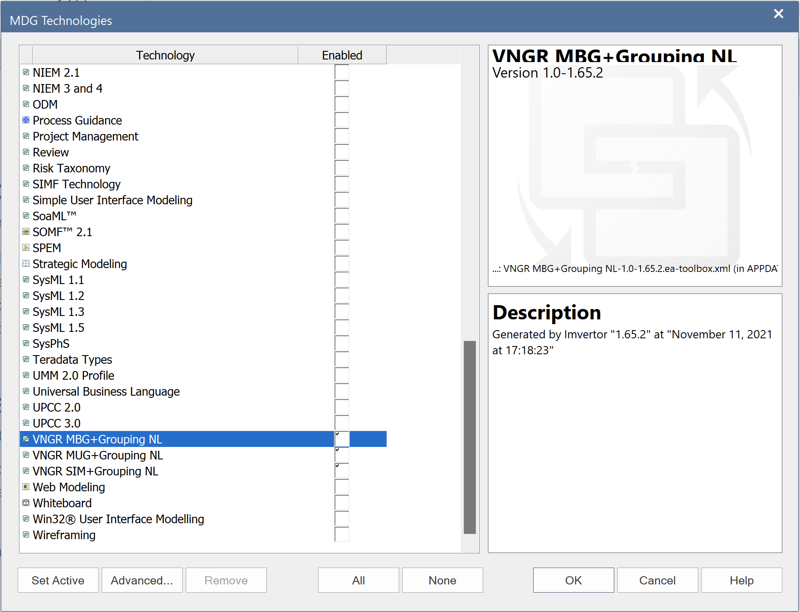
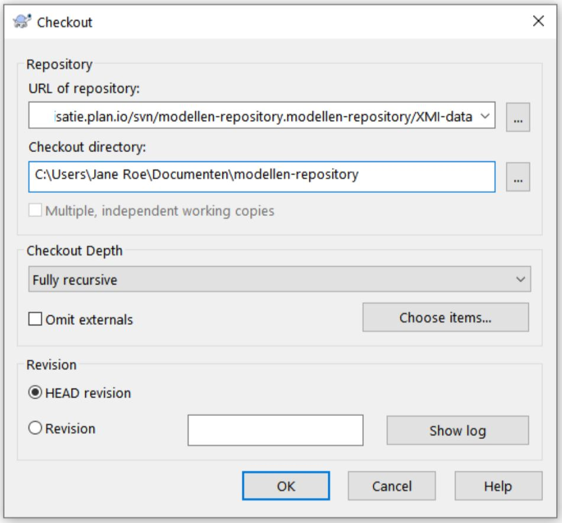

# 1. Installatie

## 1.1 Enterprise Architect configureren.

Om EA te gebruiken binnen de nieuwe aanpak zijn er een aantal handelingen vereist.
Ten eerste moet EA geïnstalleerd worden. Daarna moeten er een aantal externe tools en profiles geïmporteerd worden en ten slotte moeten er enkele configuratie acties binnen EA worden uitgevoerd. Deze handelingen worden hieronder beschreven.

### 1.1.1 Installeren EA

Benader voor het verkrijgen van het installatiebestand de daarvoor verantwoordelijke persoon binnen uw organisatie.
VNG Realisatie werkt nog met versie 15.2, zij installeren dus [die versie](https://vngrealisatie.plan.io/svn/king.stufmaster/algemeen/Software/easetupfull_152.msi). Als je deze al geïnstalleerd hebt hoef je EA natuurlijk niet opnieuw te installeren.

Inmiddels kan ook gebruik maken van [versie 16.1](https://vngrealisatie.plan.io/svn/king.stufmaster/algemeen/Software/easetupfull161_x64.msi). Er is nog weinig ervaring bij VNG-R in de configuratie van die versie dus de in de volgende paragrafen beschreven procedures kunnen afwijken. Bij het openen van een oude EA versie bestand in EA 16.1 zal gevraagd worden deze te migreren naar een ander bestandsformaat. Het oude bestand blijft overigens wel beschikbaar maar het lijkt verstandiger dat dan niet meer te gebruiken en zelfs te verwijderen. Het nieuwe formaat kan niet in een oudere versie van EA worden geöpend. Dat geldt natuurlijk niet voor de XMI bestanden.  Een [Enterprise Architect viewer](https://www.sparxsystems.eu/enterprise-architect/ea-lite-edition) kan vrij van licentiekosten worden gedownload zodat de Enterprise Architect bestanden ook door anderen bestudeert kunnen worden.

### 1.1.2 EA Toolpack installeren

Alhoewel deze toolpack niet meer noodzakelijk is voor het gebruik van imvertor biedt deze wel enkel handige tools zoals de Navigator en de Message Composer.

De nieuwste versie van dit script kan kostenloos worden opgehaald op de [website van Geert Bellekens](https://bellekens.com/product/bellekens-enterprise-architect-toolpack/) . Voeg EA Toolpack toe aan de winkelwagen. De website gebruikt een webshop om downloads aan te bieden. Het is niet verplicht een account aan te maken maar even naam en organisatie invullen moet wel. Na "afrekenen" (het bestand is gratis te verkrijgen) kun je het bestand downloaden.

### 1.1.3 Imvertor Addin installeren

De imvertor Addin is noodzakelijk om UML-modellen vanuit EA te kunnen aanbieden aan de Armatiek-SAAS omgeving waar Imvertor draait. Download hier de Imvertor-Addin : [32 bits](https://armatiek.nl/Imvertor/download/4.2.0.0/EAImvertorAddinSetup32.exe), [64 bits](https://armatiek.nl/Imvertor/download/4.2.0.0/EAImvertorAddinSetup64.exe). Stop EA vóór de installatie.

[Hier](https://armatiek.nl/doc/imvertor/imvertor-startup/1.0/) vind je nog wat meer informatie m.b.t. de Addin.

### 1.1.4 Profielen/Metamodellen MIM, MUG en MBG importeren

De volgende metamodellen zijn beschikbaar (zie gelinkte bestanden):
 - [Metamodel Informatiemodellen Modellering:](./bestanden/VNGR%20SIM+Grouping%20NL-1.1-1.65.2.ea-toolbox.xml) (MIM)
 - [Metamodel UitwisselingsGegevensmodel VNG-R:](./bestanden/VNGR%20MUG+Grouping%20NL-1.0-1.65.2.ea-toolbox.xml) (MUG)
 - [Metamodel BerichtstructuurGegevens VNG-R:](./bestanden/VNGR%20MBG+Grouping%20NL-1.0-1.65.2.ea-toolbox.xml) (MBG)

Welke je moet installeren is afhankelijk van je werkzaamheden. Ben je alleen verantwoordelijk voor het produceren van SIM's of CIM's dan installeer je alleen de eerste. Indien je ook of juist verantwoordelijk bent voor het vervaardigen van UGM's dan installeer je de eerste en de tweede en als je BSM's moet kunnen maken dan dien je ze alledrie te installeren.

In Enterprise Architect kan je via **Specialize / Technologies / Publish-Tech / Import MDG Technology** de profielen met de metamodellen voor de diverse model-varianten importeren.  
In Enterprise Architect 16.1 gaat dat via **Specialize / Technologies / Publish Technology / Import MDG Technology**

Let er wel op dat je de **"Import to User"** gebruikt, dan heb je immers in ieder project dat je opent of nieuw maakt de beschikking over deze profielen.

De Metamodellen komen dan beschikbaar in de Toolbox.

Noot: als je een profiel wilt verwijderen, dan kan je dat als volgt doen:
- als het profiel alleen in het 'model' is geïmporteerd dan kan het binnen Sparx verwijderd worden: **Specialize / Technology / Manage-Tech" (remove)**
- als het profiel in ‘User’ is opgenomen, dan moeten de bestanden handmatig worden verwijderd. Open Windows Explorer en ga naar %APPDATA%\Sparx Systems\EA\MDGTechnologies. Daarbij is %APPDATA% over het algemeen gelijk aan "C:\Users\%username%\AppData\Roaming\". Dus bijvoorbeeld: "C:\Users\Jans_J\AppData\Roaming\Sparx Systems\EA\MDGTechnologies".
Let op: de AppData folder is normaliter HIDDEN!
Verwijder vervolgens het betreffende MDG.bestand.

### 1.1.5 Activeren metamodellen

Na het laden van de MIG, MUG en MBG profielen (zie boven) moeten deze geactiveerd worden in de configuratie van de Schema Composer.  Deze is te bereiken via **Specialize / Technologies / Manage-Tech**.  

In geval er meerdere MUG-profielen zichtbaar zijn in het configuratiescherm moeten deze alle aangevinkt worden wegens een onbekende bug in EA.

Tevens moet in en overbodige profielen uitgezet worden. De profielen die minimaal actief moeten zijn, zijn:
- 'Basic UML 2 Technology'
- 'Core Extensions'
- 'MIG' of 'MIM'
- 'MUG'
- 'MBG'

### 1.1.6  Aanpassen metamodellen

Zo nu en dan moeten de metamodellen worden aangepast. Bijv. omdat er nieuwe stereotypes geconfigureerd moeten worden.
Het toevoegen van nieuwe stereotypes kan pas gebeuren nadat dit goed is afgestemd met elkaar aangezien nieuwe stereotypes kunnen conflicteren met het vigerende metamodel (MIM, MUG of MBG).

Het aanpassen vande metamodellen gebeurd door de Imvertor configuratiebestanden aan te passen en vervolgens een met dat metamodel gerelateerd informatiemodel, Uitwisselingsgegevensmodel of Bericht Structuur model te processen met Imvertor.
Na processen vind je in de folder 'ea' van de zipfile het nieuwe in Enterprise Architect te importeren model. Zie paragraaf '1.1.4 Profielen/Metamodellen MIG en MUG importeren' voor het importeren van het model.

### 1.1.7 SVN configureren voor EA

Hieronder worden de stappen beschreven die je moet doorlopen om Enterprise Architect geschikt te maken voor het werken met Subversion.

- Enterprise Architect werkt direct op subversion en niet met Tortoise. Je moet er dus voor zorgen dat je over de SVN executable ‘svn.exe’ beschikt. Dit kan door Tortoise te installeren (wat sowieso handig is voor een van de volgende stappen). Heb je Tortoise al geïnstalleerd dan is de kans groot dat je de svn command line client niet hebt geïnstalleerd.  Installeer dan Tortoise opnieuw of download de laatste versie van Tortoise en installeer deze. Selecteer daarbij in het Tortoise setup menu de optie ‘Will be installed on local hard drive’ bij ‘command line client tools’ en start daarna opnieuw op:  

- Hierna dien je een working copy aan te maken in je filesysteem van de modellen repository. Kies daarvoor eerst de gewenste locatie in je filesysteem en creëer indien gewenst nog een folder;
- Binnen de zojuist gekozen of vervaardigde folder check je vervolgens de modellen repository uit. Dit doe je door met de rechtermuistoets op de folder te klikken en dan te kiezen voor 'SVN Checkout...'. Het volgende menu verschijnt dan:    
- Het veld 'URL of repository' krijgt de waarde 'https://vngrealisatie.plan.io/svn/modellen-repository.modellen-repository/XMI-data'. Het veld 'Checkout directory' verwijst naar de geselecteerd folder;
- Als je op 'OK' klikt worden er lokaal een aantal folders en bestanden geplaatst. Om deze repository te kunnen gebruiken moet je mogelijk inloggen. Vraag authorisatie aan bij Robert Melskens of Michiel Verhoef indien je die nog niet hebt;
- We gaan nu in EA een aantal versioncontrol configuraties aanmaken die je in de gelegenheid stellen eenvoudig naar de subversion folders te navigeren. Afhankelijk van welke modellen je denkt te gaan produceren moet je enkele of alle volgende configuraties aanmaken voor de volgende folders:
  - trunk/SIM;
  - trunk/UGM;
  - trunk/BSM;
  - branches/SIM;
  - branches/UGM;
  - branches/BSM;
  - tags/SIM;
  - tags/UGM;
  - tags/BSM.
- Open daarvoor in Enterprise Architect het lege template EA bestand dat je [hier](./bestanden/Standaard-basis.EAP) kunt vinden. Hier gaan we niets mee doen maar een geopend EA bestand is een voorwaarde om SVN in Enterprise Architect te configureren;
- Het bestand voorziet je ook al van de genoemde SVN configuraties die je dan alleen nog maar hoeft te vullen. Als het goed is krijg je dan ook bij het openen van dat bestand de melding  _One or more Version Control configurations used by this are not fully defined on this machine. Would you like to complete the set up now?_  Aangezien dat de bedoeling is klik je op 'Yes'.  **Let op**: Indien je de genoemde melding niet krijgt dan heb je de configuraties waarschijnlijk toch al ingegeven. In dat geval is het goed om deze even te checken. Ga daarvoor binnen Enterprise Architect naar ***Configure / Version Control / Project-VC***. 
- Je krijgt nu het volgende menu:  
  Waarbij je bij de 'Defined Configurations' dus al de negen genoemde configuraties ziet staan (in de illustratie hierboven is deze echter leeg).
- Voor elk van deze negen configuraties doe je nu het volgende:
  - Selecteer de configuratie;
  - Bepaal of de configuratie voor jou van toepassing zal zijn. Als je je nooit bezig houdt met het ontwikkelen van SIM's, heb je de configuratie 'Imvertor-trunk-SIM' niet nodig. Indien dit niet het geval is verwijder hem dan.
  - Indien de configuratie wel van toepassing is geef dan aan dat het version control van het type ‘Subversion’ is;
  - Kies het path naar de gerelateerde SVN folder. Helaas kan je daarbij geen copy and paste van een voorgaand path toepassen;
  - Geef aan waar de ‘svn.exe’ nu staat (dit hoef je waarschijnlijk alleen bij de eerste configuratie te doen)    
- Bewaar de configuratie.

De volgorde waarin de configuraties zijn opgevoerd is bepalend voor de volgorde waarin deze verschijnen in het pull-down menu voor het ophalen van de packages. Indien je het meest modellen uit de tags ophaalt dan is het wellicht handiger om de configuraties 'Imvertor-tags-SIM', 'Imvertor-tags-UGM' en 'Imvertor-tags-BSM' als eerste op te voeren. In dat geval zul je de oude configuraties toch moeten verwijderen en de configuraties helemaal zelf op moeten voeren.

- Als je alle 9 configuraties hebt vervaardigd dan kan je het menu sluiten.  

### 1.1.8 Tagged value SourceAttribute navigeerbaar (klikbaar) maken

- Ga naar **Configure / Reference Data / UML Types** (in EA 16.1 **Settings / Reference Data / UML Types**), voeg daar de tag name 'SourceAttribute' toe (***Let op!*** hoofdletter 'S' en 'A') met de onderstaande vulling:  

- Klik op _Save_.

### 1.1.9 Traceability script beschikbaar maken in project browser.

Installeer de laatste versie van het traceability script. Zie daar voor [dit zip bestand](./bestanden/Set%20Traceability%20Scripts%20with%20and%20without%20transformation%202023-06-08.zip).

Het set traceability script wordt geimporteerd via **Configure / Model / Transfer / Import Reference Data / Import File**

Als je dat gedaan hebt zal je zien dat er nu in je 'Specialize' context menu bij het rechtsklikken op een package een optie is bijgekomen:
'Scripts' met de subopties 'Set Traceability with Transformation' en 'Set Traceability without Transformation'. 

## Aan het werk

Je bent nu klaar om aan het werk te gaan. Het is echter handig om eerst de hoofdstukken [2 Begrippen](./Begrippen) en [3 Het drie-lagen model](./Drielagen-model) door te lezen. Daarna kun je m.b.v. hoofdstuk [4 Model Driven Design](./ModelDrivenDesign)  daadwerkelijk aan de slag.
