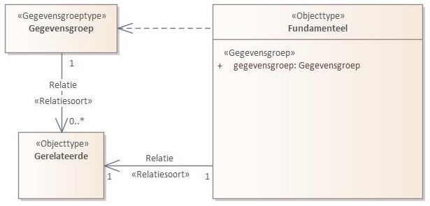
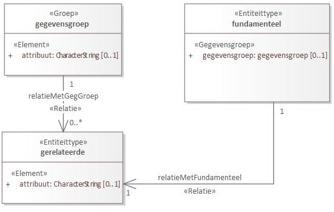
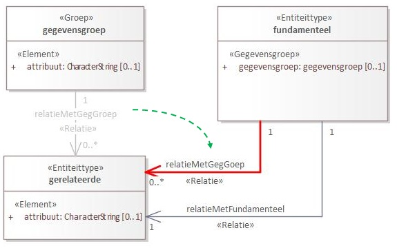
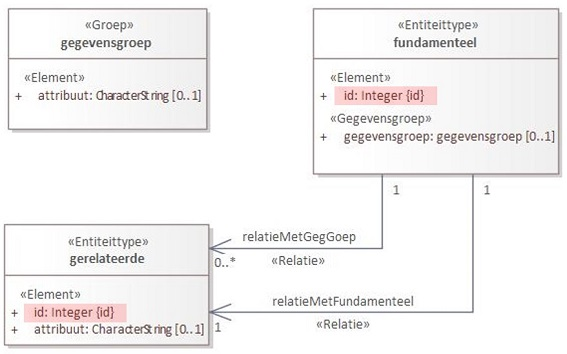
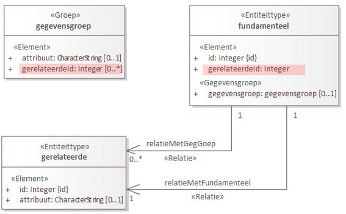
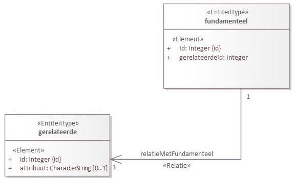
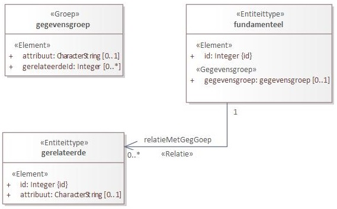

# 4.3.1 Technische en implementatie-overwegingen

Hier kunnen we documenteren welke overwegingen er zijn toegepast bij het opstellen van het UGM. Daarbij kan gebruik gemaakt worden van voorbeelden.

<!--In mijn beleving wordt dit hoofdstuk wat vroeger het "verStUFfingsdocument"  was.

**Noot Robert:** Nee, dat klopt niet. Hier wordt uitgelegd wat de gedachte achter de creatie van een UGM is (in feite ook de gedachte achter het verStUFfingsdocument). In de volgende paragrafen moet dan uitgelegd worden welke methodes er bij het creëren van een UGM kunnen worden gehanteerd. Het zou kunnen dat deze pagina voor het yaml deel uiteindelijk vervangen wordt door de API Best Practices. Op zijn minst voor de principes, wellicht dat hier dan alleen nog wat handreikingen worden gedaan m.b.t. de wijze waarop in de praktijk met de API Best Practices in de UGM's moet worden omgegaan.

Een voorzet voor de API Best Practices vind je "[hier](https://github.com/VNG-Realisatie/API-Kennisbank/blob/master/Analyse%20API%20Design/Analyse%20API%20Design.md gedaan)". -->

## Generieke methodes

### Verwerking 'isEen' relaties

Het komt af en toe voor dat in een Informatiemodel een objectclass middels meerdere 'isEen' relaties verwijst naar andere objectclasses.
Het lijkt er dan op dat de objectclass meerdere supertypeclasses heeft. In de met deze relaties gekoppelde objectclasses zijn dan attributen aangebracht die specifiek zijn voor het betreffende type.
Binnen UGM zal je deze 'isEen' relaties waarschijnlijk willen oplossen. Dat kun je doen door de betreffende attributen op te nemen in de verwijzende entiteit en daarnaast een 'xxxType' attribuut op te nemen waarmee je bij de instantiërende resource kunt aangeven om wat voor type het gaat. Dat attribute kent dan als datatype een enumeratie.

### Toekomstig in te vullen objecttypen

Bij het vervaardigen van een informatiemodel baseren we ons op de realiteit. Sterker nog, een informatiemodel is niet anders dan een model van de realiteit. De realiteit is echter complex en bij het modelleren simplificeer je de realiteit vooral kijkend naar wat je nodig hebt om de userstories in te kunnen vullen. Af en toe zal je daarbij een voorschot nemen op mogelijk in de toekomst in te vullen userstories met als gevolg dat er objectclasses in het informatiemodel worden opgenomen die je (nog) niet nodig hebt.
In het UGM, waarin we alleen dat modelleren wat we voor de userstories technisch nodig hebben worden de entiteiten die relateren aan deze objectclasses dan ook verwijderd.

### Van Model naar OAS specificatie: Relaties
In de UGM en BSM modellen komen met regelmaat relaties tussen Entiteittypen en andere Entiteittypen maar ook tussen Groepen en Entiteittypen voor. De wijze van modelleren heeft invloed op de manier waarop deze naar OAS (json danwel hal+json) worden vertaald. Er zijn een aantal regels die gehanteerd moeten worden bij het modelleren in UGM en BSM en een aantal regels die toegepast moeten worden door de stylesheets die op basis van de modellen de specificaties genereren. Idealiter zijn de regels die we hanteren bij het modelleren voor een OAS specificatie in json formaat gelijk aan de regels die we hanteren bij het modelleren van een OAS specificatie in hal+json formaat. Daardoor worden de modellen onafhankelijk van het te genereren OAS formaat.

#### Modelleren
In een SIM modelleren we relaties door een associatie aan te brengen tussen twee Objecttypen of tussen een Gegevensgroeptype en een Objecttype. Deze krijgt vervolgens het stereotype ‘Relatiesoort’. Zie het volgende voorbeeld:



Bij de omzetting naar UGM worden de Objecttypen omgezet naar Entiteittypen, de Gegevensgroeptypen naar Groepen en het stereotype ‘Relatiesoort’ van de associatie naar ‘Relatie’. Als volgt dus: 

 

Daarna moet aan de tagged value ‘Target role in meervoud’ van de Relaties een naam wordt toegekend die het meervoud is van de naam van het Entiteittype waarnaar de Relatie loopt. Ook de kardinaliteit van zo’n Relatie wordt aan beide zijden van de Relatie gespecificeerd.

We kiezen er op dit moment voor om de Relaties die lopen tussen een Groep en een Entiteittype in het UGM aan te passen. De source kant van de relatie wordt verlegd naar het fundamentele Entiteittype.  We maken deze keuze zodat we in de Imvertor code geen logica hoeven op te nemen die deze aanpassing automatisch in het geval van hal+json doorvoert. Als we op een later moment besluiten die aanpassing alsnog in de code door te voeren dan zullen dit soort aanpassingen op de UGM modellen niet meer hoeven te worden aangebracht.

  

Bij alle Objecttypen (ongeacht of het nu de fundamentele of een gerelateerde is) die nog niet beschikken over een uniek identificerend attribuut wordt in het UGM een technisch uniek identificerend attribuut aangemaakt.

  

In het Entiteittype dat onderwerp is of gaat worden van een bericht (hier de Entiteittype ‘fundamenteel’ en in de OAS specificatie de resource van een bericht), het ‘fundamenteel’ Entiteittype dus, wordt voor alle Relaties die vandaaruit naar een (gerelateerd) Entiteittype lopen een verwijzend attribuut opgenomen. Attributen dus die de gerelateerde Entiteittypes identificeren. Deze hebben dus dezelfde kenmerken als het identificerende attribuut van dat gerelateerde Entiteittype. Zie in het volgende diagram het attribuut ‘gerelateerdeId’ in het Entiteittype ‘fundamenteel’.
De tagged value ‘Is afgeleid’ krijgt bij de beide ‘gerelateerdeId’ attributen de waarde ‘Nee’ en er wordt daar ook geen tagged value ‘SourceAttribute’ opgenomen. 
Let op! De kardinaliteit van dit attribuut moet gelijk zijn aan de kardinaliteit van de target zijde van de relatie waaraan deze gerelateerd is.

Voor Relaties die oorspronkelijk in het SIM vanuit een Gegevensgroeptype naar een Objecttype liepen maar waarvoor nu de source verlegd is naar het ‘fundamenteel’ Entiteittype wordt een verwijzend attribuut opgenomen in de Groep. Ook deze hebben weer dezelfde kenmerken als het identificerende attribuut van dat ‘gerelateerde’ Entiteittype en ook hier geldt dezelfde opmerking m.b.t. diens kardinaliteit. Zie in het volgende diagram het attribuut ‘gerelateerdeId’ in de Groep ‘gegevensgroep’.

  

Als naam voor de properties die verwijzen naar het identificerende property van een gerelateerd Entiteittype gebruiken we ‘Id’ voorafgegaan door de naam van de entiteit waarnaar verwezen wordt (dus bijv. ‘persoonId’). Als er meerdere Relaties naar dezelfde entiteit zijn dan nemen we in de naam de naam van de Relatie op. I.p.v. de naam van het Entiteittype komt dan de naam van de Relatie (dus bijv. ‘ouderVanId’ en ‘kindVanId’).

Bij het genereren van json kiezen we er voorlopig voor geen gerelateerde Entiteittypes embedded op te nemen. Deze keuze is echter nog onderwerp van discussie. Wel kunnen er tijdens het modelleren natuurlijk attributen van een ander Entiteittype platgeslagen worden in een ander Entiteittype. 

Bij hal+json kunnen Entiteittypes wel embedded opgenomen worden. Indien we een OAS specificatie in het hal+json formaat willen genereren en daarbij een gerelateerde Entiteittype embedded op willen nemen moet het Entiteittype daarvan in het UGM en BSM minimaal het identificerende attribuut en een niet identificerend attribuut bevatten. In alle andere gevallen mag het Entiteittype leeg blijven. In dat geval zal er in de OAS specificatie alleen een link worden opgenomen in de ‘_links’ property. 
De afspraak binnen VNG-R is dat we in hal+json relaties nooit dieper dan 1 niveau embedded modeleren. Indien dieper gemodelleerd wordt dan wordt dit echter wel zonder problemen gegenereerd. In principe zit hier geen beperking op.
 
#### JSON Genereren

<b><span style="color:red">Deze paragraaf is nog in discussie.</span></b>

In deze en de volgende paragraaf ga ik er vanuit dat het fundamentele Entiteittype de naam ‘fundamenteel’ heeft, het gerelateerde Entiteittype de naam ‘gerelateerd’ en de gegevensgroep de naam ‘gegevensgroep’. Op het Entiteittype ‘gerelateerd’ zijn 2 attributen gedefinieerd waarvan er één identificerend is. 

De Groep ‘gegevensgroep’ is alleen van toepassing voor de paragrafen ‘Relatie tussen Groep en Entiteittype’.

##### Relatie tussen 2 Entiteittypen

 

In de specificatie van het bericht zal een verwijzing worden opgenomen naar de ‘fundamenteel’ Entiteittype. Dat bevat naast het eigen identificerende property het identificerende property van de ‘gerelateerde’ Entiteittype. Er wordt geen property opgenomen met daarin de uri naar dat ‘gerelateerde’ Entiteittype.

```
Fundamenteel:
  type: "object"
  required:
  - "id"
  - "gerelateerdeId"
  properties:
    id:
      type: "integer"
    gerelateerdeId:
      type: "integer"
Gerelateerde:
  type: "object"
  required:
  - "id"
  properties:
    id:
      type: "integer"
    attribuut:
      type: "string"
```

##### Relatie tussen Groep en Entiteittype

 

Bij een Relatie tussen een in het ‘fundamenteel’ Entiteittype aanwezige Gegevensgroep en een Entiteittype bevat het ‘fundamenteel’ Entiteittype een property met een link naar de Groep. In die Groep is nu de property met de identificatie van het gerelateerde Entiteittype te vinden. Ook nu is er nergens een property opgenomen met daarin de uri naar dat gerelateerde Entiteittype.

```
Fundamenteel:
  type: "object"
  required:
  - "id"
  properties:
    id:
      type: "integer"
    gegevensgroep:
      $ref: "#/components/schemas/Gegevensgroep"
Gegevensgroep:
  type: "object"
  properties:
    gerelateerdeId:
      type: "integer"
    attribuut:
      type: "string"
Gerelateerde:
  type: "object"
  required:
  - "id"
  properties:
    id:
      type: "integer"
    attribuut:
      type: "string"
```

#### HAL+JSON Genereren

##### Relatie tussen 2 Entiteittypen

 


In de specificatie van het bericht zal een verwijzing worden opgenomen naar ‘FundamenteelHalCollectie’ of ‘FundamenteelHal’. In het geval van de eerste dan wordt daarbinnen verwezen naar de tweede.
De inhoud van ‘FundamenteelHal’ is vervolgens afhankelijk van de keuze die bij het modelleren is gemaakt. Naast een referentie naar het schema-component dat de inhoud van het ‘fundamenteel’ Entiteittype bevat (‘Fundamenteel’) incl. de identificerende property van het ‘gerelateerde’ Entiteittype, bevat het ook een link naar het schema-component ‘Fundamenteel_links’ en kan het ook een link naar het schema-component ‘Fundamenteel_embedded’ bevatten.

‘Fundamenteel_links’ wordt dus altijd gegenereerd en wel binnen de property ‘_links’. Het schema-component ‘Fundamenteel_links’ bevat naast de property ‘self’, voor alle in het UGM en BSM met het ‘fundamenteel’ Entiteittype gerelateerde Entiteittypen een property met als naam de in de tagged value ‘Target role in meervoud’ gespecificeerde waarde. Die properties refereren allen naar ‘…./common.yaml#/components/schemas/HalLink’.

De tweede (‘Fundamenteel_embedded’) wordt alleen gegenereerd als minimaal een van de met het ‘fundamenteel’ Entitetitype gerelateerde Entiteittypes in het UGM en BSM een niet identificerend attribuut bevat. In dat geval wordt deze in de property ‘_embedded’ geplaatst die een referentie heeft naar het Hal component van het ‘gerelateerde’Entiteittype. In dit voorbeeld leidt de link naar ‘GerelateerdeHal’. Dat schema-component bevat vervolgens een referentie naar het schema-component ‘Gerelateerde’, waarin de properties van dat schema-component en de property ‘_links’ met een referentie naar ‘Gerelateerde_links’ staan.

Het uiteindelijke schema resultaat is dus als volgt:

```
FundamenteelHalCollectie:
  type: "object"
  properties:
	_links:
	  ...
	_embedded:
	  type: "object"
	  properties:
		fundamentelen:
		  type: "array"
		  items:
			$ref: "#/components/schemas/FundamenteelHal"
FundamenteelHal:
  allOf:
  - $ref: "#/components/schemas/Fundamenteel"
  - type: "object"
	properties:
	  _links:
		$ref: "#/components/schemas/Fundamenteel_links"
	  _embedded:
		$ref: "#/components/schemas/Fundamenteel_embedded"
Fundamenteel_links:
  type: "object"
  properties:
	self:
	  $ref: ".../common.yaml#/components/schemas/HalLink"
	gerelateerden:
	  $ref: ".../common.yaml#/components/schemas/HalLink"
Fundamenteel_embedded:
  type: "object"
  properties:
	gerelateerden:
	  $ref: "#/components/schemas/GerelateerdeHal"
GerelateerdeHal:
  allOf:
  - $ref: "#/components/schemas/Gerelateerde"
  - type: "object"
	properties:
	  _links:
		$ref: "#/components/schemas/Gerelateerde_links"
Gerelateerde_links:
  type: "object"
  properties:
    self:
      $ref: ".../common.yaml#/components/schemas/HalLink"
Fundamenteel:
  type: "object"
  required:
  - "id"
  - "gerelateerdeId"
  properties:
    id:
      type: "integer"
    gerelateerdeId:
      type: "integer"
Gerelateerde:
  type: "object"
  required:
  - "id"
  properties:
    id:
      type: "integer"
    attribuut:
      type: "string"
```

De schema-componenten 
* 'FundamenteelHalCollectie';
* 'Fundamenteel_embedded';
* 'GerelateerdeHal';
* 'Gerelateerde_links';
* en 'Gerelateerde'.

komen afhankelijk van de modellering wel of niet voor.

##### Relatie tussen Groep en Entiteittype

 

In dit geval zal het schema-component ‘Fundamenteel’ een property ‘gegevensgroepen’ kennen i.p.v. het attribuut ‘gerelateerdeId’. Dat attribuut zal zijn opgenomen in het schema-component ‘Gegevensgroep’. Natuurlijk is ook het schema-component ‘Fundamenteel_embedded’ gewijzigd aangezien de Relatie met het Entiteittype ‘gerelateerde’ hier meerdere keren voor kan komen. Hieronder zie je alleen die drie schema-componenten:

```
Fundamenteel:
  type: "object"
  required:
  - "id"
  properties:
    id:
      type: "integer"
    gegevensgroep:
	$ref: "#/components/schemas/Gegevensgroep"
Gegevensgroep:
  type: "object"
  properties:
    gerelateerdeId:
	type: "integer"
    attribuut:
	type: "string"
Fundamenteel_embedded:
  type: "object"
  properties:
	gerelateerden:
	  type: "array"
	  items:
		$ref: "#/components/schemas/GerelateerdeHal"
```


<!--h2. Yaml specifieke methodes

### uuid en url attributen

Alle resources moeten m.b.v. een uuid op te vragen zijn en alle resources worden ook met een unieke url ontsloten. Om die reden wordt aan alle entiteiten in het UGM de attributen 'uuid' en 'url' toegevoegd.


## VerStUFfingsmethodes

**Noot Robert:** Dit hoofdstuk moet door Henri gevuld worden. Eigenlijk moeten we de term 'VerStUFfen' uitfaseren.

Hier komt een uitleg m.b.t. de overwegingen om objecttypen samen te voegen of plat te slaan in andere objecttypen, gegevensgroepen te koppelen en (technische) attributen toe te voegen.

## VerStUFfingsmethodes domeinspecifiek UGM

In een domeinspecifiek SIM wordt (meestal) ergens een koppeling gemaakt met het RSGB of het RGBZ. Over het algemeen zal 1 of meer objecten uit het RSGB of het RGBZ ook voorkomen in het domeinspecifieke SIM. Eventueel ook met een aantal domeinspecifiek toegevoegde  attributen.

In het domeinspecifieke SIM wordt deze relatie gelegd door  een objecttype op te nemen met dezelfde naam als de naam die in het SIM RSGB of het SIM RGBZ wordt gehanteerd en deze als Stereotype "Proxy" op te nemen. In deze klasse worden de gewenste attribuutsoorten die reeds in het RSGB gedefinieerd zijn ook opgenomen, maar ook in dit geval met de stereotype "Proxy". Bij beide proxies (zowel de objecttypen als de attribuutsoorten) worden geen eigenschappen opgenomen en wordt voor het ophalen van deze eigenschappen een trace aangelegd tussen de "Proxy" klassen en het objecttype uit het RSGB dat als bron dient.  

Eventuele toe te voegen attribuutsoorten (die we in het RSGB dus nog niet kennen) worden in de Proxy-klasse opgenomen met het stereotype "Attribuutsoort".  Bij deze toegevoegde attribuutsoorten moeten wel alle eigenschappen worden opgenomen die nodig zijn om de attribuutsoort eenduidig te kunnen definiëren.

Daarnaast kunnen in een koppelvlak-specifiek SIM objecttypen worden toegevoegd die onderling, (maar ook met de Proxy-klassen) gerelateerd kunnen zijn. Deze toegevoegde objecttypen hebben ook het stereotype objecttype
Dat ziet er bijvoorbeeld als volgt uit. De beige objecttypen zijn domeinspecifiek en de blauwe objecttypen zijn onderdeel van het SIM RSGB.

 

Het bovenstaande is een voorbeeld van een Informatiemodel dat ten grondslag ligt aan het UitwisselingsGegevensModel (UGM) dat wordt opgesteld t.b.v. een koppelvlak. Bij het maken van een domeinspecifiek (of koppelvlakspecifiek) UGM wordt enerzijds hergebruik gemaakt van entiteittypen die al eerder gemodelleerd zijn en anderzijds worden er nieuwe entiteittypen geïntroduceerd naar aanleiding van nieuw in het domeinspecifieke informatiemodel gedefinieerde objecttypen.

Voor die objecttypen die  in het domeinspecifieke informatiemodel als proxy zijn opgenomen wordt gekeken naar het UGM waarin de betreffende objecttypen al eerder zijn vormgegeven tot entiteittype. Hierbij zijn "verStUFfingsregels" toegepast. De kans is zeer groot dat de overwegingen om objecttypen samen te voegen, gegevensgroepen te koppelen of (technische) attributen toe te voegen die eerder van toepassing waren ook bij het maken van het domeinspecifieke UGM van toepassing zullen zijn.

Kort samengevat geldt dat voor elk Proxy-objecttype dat opgenomen is in het domeinspecifieke SIM het corresponderende entiteittype gekopieerd wordt  uit het "generieke" UGM. (Het UGM dat is afgeleid van het SIM waarnaar de Proxy verwijst).
Vervolgens wordt dit gekopieerde entiteittype op maat gemaakt voor het domeinspecifieke UGM. Attributen worden verwijderd als deze niet voorkomen in het koppelvlak en attribuutsoorten die in een Proxy klasse zijn toegevoegd worden in het entiteittype toegevoegd als attribuut.

 

p{color:red}. *Noot Robert:* Op de nieuwe entiteittypen die naar aanleiding van nieuw in het domeinspecifieke informatiemodel gedefinieerde objecttypen in het domeinspecifieke UGM worden geïntroduceerd kan net zoals de entiteittypen in de "generieke" UGM's natuurlijk ook een verStUFfingsslag van toepassing zijn. Daarvoor gelden dezelfde technieken als voor het verStUFfen van entiteittypen in de "generieke" UGM's (zie de voorgaande paragraaf). -->
